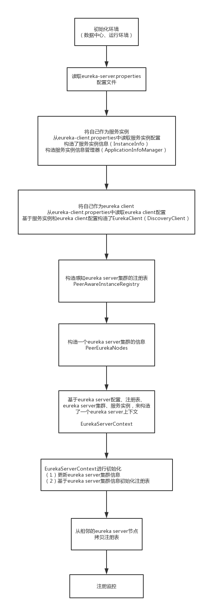
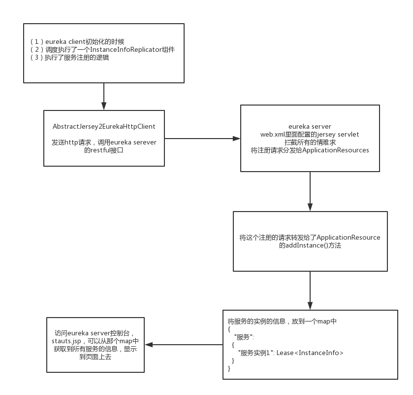
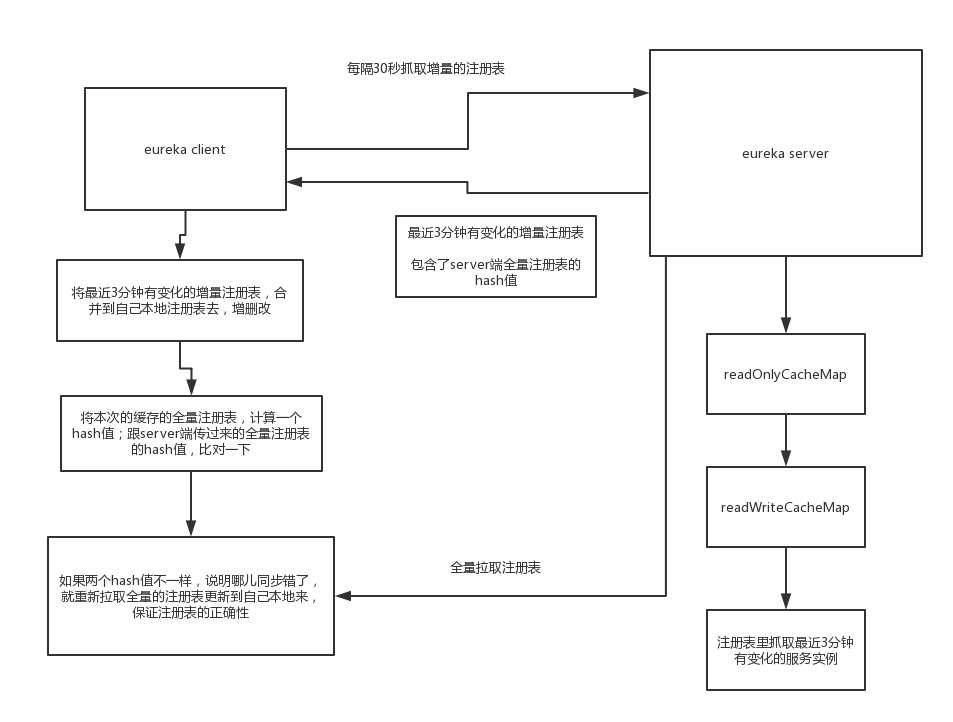
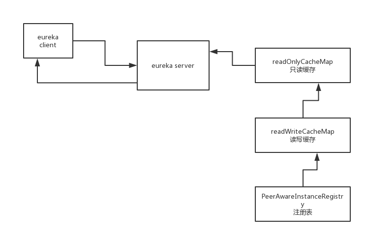
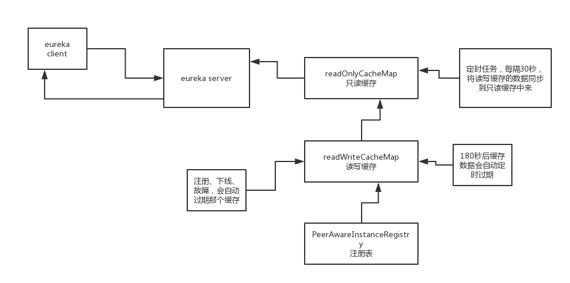
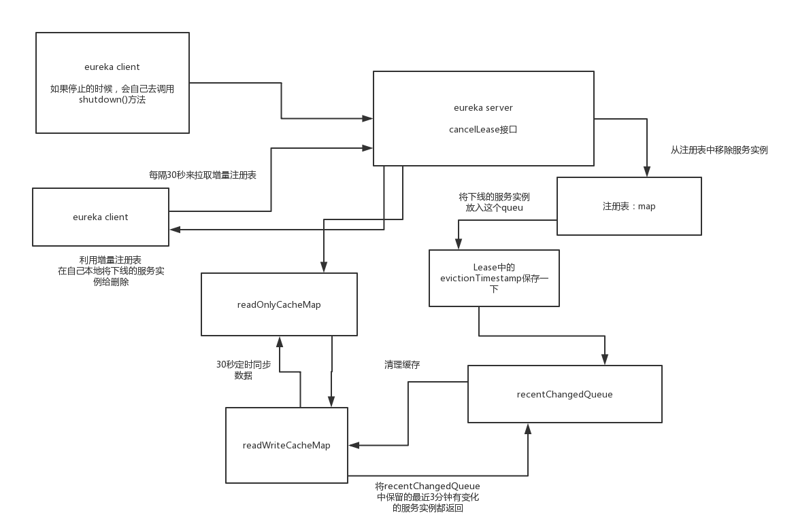

### 1. Server 端启动流程



- 读取配置(eureka-server.properties)
- 构造实例(InstanceInfo)
- 构造服务实例管理器(ApplicationInfoManager)
- 读取本身作为客户端的配置(eureka-client.properties)
- 基于 client 配置和服务实例管理器，构造 EurekaClient 配置(DiscoveryClient)
- 保存了一些配置，处理服务的注册和注册表的抓取，启动了几个线程池，启动了网络通信组件，启动了一些调度任务，注册了监控项


### 2. Client 端启动流程


- 实例注册管理器(InstanceRegisterManager)

- InstanceInfoReplicator的start()方法里面，将自己作为一个线程放到一个调度线程池中去了，默认是延迟40s去执行这个线程，还将isDirty设置为了ture

- 如果执行线程的时候，是执行run()方法

- 找EurekaClient.refreshInstanceInfo()这个方法，里面其实是调用ApplicationInfoManager的一些方法刷新了一下服务实例的配置，看看配置有没有改变，如果改变了，就刷新一下；用健康检查器，检查了一下状态，将状态设置到了ApplicationInfoManager中去，更新服务实例的状态

- 因为之前设置过isDirty，所以这里会执行进行服务注册

- 服务注册的时候，是基于EurekaClient的reigster()方法去注册的，调用的是底层的TransportClient的RegistrationClient，执行了register()方法，将InstanceInfo服务实例的信息，通过http请求，调用eureka server对外暴露的一个restful接口，将InstanceInfo给发送了过去。这里找的是EurekaTransport，在构造的时候，调用了scheduleServerEndpointTask()方法，这个方法里就初始化了专门用于注册的RegistrationClient

- 找SessionedEurekaHttpClient调用register()方法，去进行注册，看到这里，基本上就被他的这个类体系给绕晕了，我在项目阶段一里面虽然用了很多的设计模式，但是基本上就一两层，或者是两三层，一般很快你就会找到一个东西的实现类

- 他对RegistrationClient的类体系的设计，非常的不合理，我们找了半天，都没找到，到底是哪个client，找的人是眼花缭乱。如果说你在看源码的时候，发现了这个问题，其实这个时候，发挥一个思想：连蒙带猜。我个人坚决不支持这样来设计源码，如果你这么来设计，没几个人能看懂你的这个源码。好的开源项目，代码必须写的非常好，非常优雅，非常容易阅读。

- ureka大量的基于jersey框架，在eureka server上提供restful接口，在eureka client如果要发送请求到eureka server的话，一定是基于jersey框架，去发送的http restful接口调用的请求

- 真正执行注册请求的，就是eureka-client-jersey2工程里的AbstractJersey2EurekaHttpClient，请求http://localhost:8080/v2/apps/ServiceA，将服务实例的信息发送过去

- （1）eureka client的服务注册，是在InstanceInfoReplicator中的

  （2）实际发送服务注册请求的是AbstractJersey2EurekaHttpClient，调用了一个restful接口


### 3. 服务注册流程



- InstanceInfo(服务i实例) 主要包含 2 块数据

  - 主机名、ip 地址、端口号、url 地址
  - lease(租约)信息：保持心跳的时间间隔、最近心跳的时间、服务注册时间、服务启动时间

- **ConcurrentHashMap<String, Map<String, Lease<InstanceInfo>>>**

  - 注册表，核心数据结构

    ```json
    {
    	“ServiceA”: {
    		“001”: Lease<InstanceInfo>,
    		“002”: Lease<InstanceInfo>,
    		“003”: Lease<InstanceInfo>
    	},
    	“ServiceB”: {
    		“001”: Lease<InstanceInfo>
    	}
    }
    ```

- 读写锁的应用 ReentranctReadWriteLock

  - 注册的时候，上的是读锁。多个服务实例，可以同时来注册。灵活的运用读写锁，可以控制多线程的并发，有些操作是可以并发执行的，有些操作是互斥的。


### 4. Client 端注册后抓取注册表流程

- eureka client第一次启动的时候，必须从eureka server端**一次性抓取全量的注册表**的信息过来，在本地进行缓存(http://localhost:8080/v2/apps)

- 后面的话呢，**每隔30秒**从eureka server抓取**增量的注册表信息**，跟本地缓存进行合并

  
  - client 启动的时候，同时会启动一个定时调度的线程，每隔30秒，会发送一次请求到eureka server，抓取增量的注册表

  - 走EurekaHttpClient的getDelta()方法和接口，http://localhost:8080/v2/apps/delta，get请求

  - server 端registry.getApplicationDeltasFromMultipleRegions()获取增量的注册表

  - recentlyChangedQueue，代表的含义是，最近有变化的服务实例，比如说，新注册、下线的，或者是别的什么什么，在Registry构造的时候，有一个定时调度的任务，默认是30秒一次，看一下，服务实例的变更记录，是否在队列里停留了超过180s（3分钟），如果超过了3分钟，就会从队列里将这个服务实例变更记录给移除掉。也就是说，这个queue，就保留最近3分钟的服务实例变更记录。delta，增量。

  - eureka client每次30秒，去抓取注册表的时候，就会返回最近3分钟内发生过变化的服务实例

  - 抓取到的delta的注册表，就会跟本地的注册表进行合并，完成服务实例的增删改

  - 对更新完合并完以后的注册表，会计算一个hash值；delta，带了一个eureka server端的全量注册表的hash值；此时会将eureka client端的合并完的注册表的hash值，跟eureka server端的全量注册表的hash值进行一个比对；如果说不一样的话，说明本地注册表跟server端不一样了，此时就会重新从eureka server拉取全量的注册表到本地来更新到缓存里去

  - **构架设计闪光点**

    - **`增量数据的设计思路：`**

      > 如果你要保存一份增量的最新变更数据，可以基于LinkedQueue，将最新变更的数据放入这个queue中，然后后台来一个定时任务，每隔一定时间，将在队列中存放超过一定时间的数据拿掉，保持这个队列中就是最近几分钟内的变更的增量数据

    - **`数据同步的hash值比对机制:`**

      > 如果你要在两个地方，一个分布式系统里，进行数据的同步，可以采用Hash值的思想，从一个地方的数据计算一个hash值，到另外一个地方，计算一个hash值，保证两个hash值是一样的，确保这个数据传输过程中，没有出什么问题


### 5. Server 端多级缓存机制



- ApplicationsResource#getContainers()方法，获取全量注册表的方法
- eureka client发送请求过来读取全量注册表的时候，其实会从多级缓存里去读取注册表的数据，所以这里的cacheKey，就是全量注册表的缓存key
- 多级缓存机制，用了两个map，来做了**两级缓存，只读缓存map，读写缓存map**，先从只读缓存里去读，如果没有的话，会从读写缓存里去读，如果还是没有呢？如果这个读写缓存，没有缓存的话，会从eureka server的注册表中去读取
- 从注册表中获取所有的Applications，ServerCodecs，json序列化的组件，将Applications对象序列化为了一个json字符串，将注册表中读取出来的Applications，放入读写缓存，接着放入只读缓存中去
- 最后呢，就是将从多级缓存机制中读取出来的全量的Applications作为响应来返回


### 6. Server 端多级缓存过期机制



- **主动过期**
  - readWriteCacheMap，读写缓存
  - 有新的服务实例发生注册、下线、故障的时候，就会去刷新 readWriteCacheMap
  - 调用 ResponseCache.invalidate()，将之前缓存好的 ALL_APPS 这个 key 对应的缓存，给他过期掉
- **定时过期**
  - readWriteCacheMap 在构建的时候，指定了一个自动过期的时间，默认值就是 180 秒，所以你往 readWriteCacheMap 中放入一个数据过后，自动会等180 秒过后，就将这个数据给他过期了
- **被动过期**
  - readOnlyCacheMap
  - 默认是每隔30秒，执行一个定时调度的线程任务，TimerTask，有一个逻辑，会每隔30秒，对readOnlyCacheMap和readWriteCacheMap中的数据进行一个比对，如果两块数据是不一致的，那么就将readWriteCacheMap中的数据放到readOnlyCacheMap中来  -- 定时任务同步
  - 比如说readWriteCacheMap中，ALL_APPS这个key对应的缓存没了，那么最多30秒过后，就会同步到readOnelyCacheMap中去
- 很重要的问题
  - 假设有服务实例注册、下线、故障，要调用这个服务的其他服务，可能会过30秒之后才能感知到，为什么呢？因为这里在获取服务注册表的时候，有一个多级缓存的机制，最多是30秒才会去更新缓存


### 7. 心跳(服务续约)机制

> lease renewal，续约，心跳

- DiscoveryClient 初始化的时候，会去调度一堆定时任务，其中有一个就是 HeartbeatThread，心跳线程
- 在这里可以看到，默认是每隔30秒去发送一次心跳，每隔30秒执行一次HeartbeatTHread线程的逻辑，发送心跳
- 走的是 EurekaHttpClient 的 sendHeartbeat() 方法，http://localhost:8080/v2/apps/ServiceA/i-000000-1，走的是put请求
- 负责承接服务实例的心跳相关的这些操作的，是 **InstanceResource**，服务相关的controller。jersey的mvc框架，国内很少有用jersey，spring web mvc大家都看得懂。找到ApplicationResource，再次找到InstanceResource，通过PUT请求，可以找到**renewLease方法**
- 通过注册表的renew()方法，进去完成服务续约，实际进入**AbstractInstanceRegistry的renew()方法**
- 从注册表的map中，根据服务名和实例id，获取一个**Lease<InstanceInfo>**，对服务续约的代码进行了调整，让代码可读性更好，更加的优雅。实际的服务续约的逻辑，其实就是在Lease对象中，**更新一下 lastUpdateTimestamp 这个时间戳，每次续约，就更新一下这个时间戳就ok了**


### 8. 服务下线和实例摘除机制



- **EurekaClient#shutdown()**

- 比如说你如果eureka client也是跟着一个web容器来启动的，ContextListener，里面有一个contextDestroyed()，在这个方法里，你就调用eureka client的shutdown()方法就可以了

- **DiscoveryClient中的shutdown()**方法，需要你自己调用这个方法

- **DiscoveryClient中的unregister()**方法中，取消注册，调用EurekaHttpClient的cancel()方法，http://localhost:8080/v2/apps/ServiceA/i-00000-1，delete请求

- 将服务实例从eureka server的map结构的注册表中移除掉

- 最最核心的是调用了**Lease的cancel()方法**，里面保存了一个evictionTimestamp，就是服务实例被清理掉，服务实例下线的时间戳

- 将服务实例放入最近变化的队列中去，让所有的eureka client下一次拉取增量注册表的时候，可以拉取到这个服务实例下线的这么一个变化

- 服务实例变更过了，必须将之前的缓存都清理掉，**从readWriteCacheMap中清理掉**

- 然后我之前给大家讲过，定时过期的一个过程，就是有一个定时的任务，每隔30秒，将readWriteCacheMap和readOnlyCacheMap进行一个同步

- 下次所有的eureka client来拉取增量注册表的时候，都会发现readOnlyCacheMap里没有，会找readWriteCacheMap也会发现没有，然后就会从注册表里抓取增量注册表，此时就会将上面那个**recentCHangedQuuee中的记录返回**

- (1) 在注册中心，将服务实例从注册表中移除，下线的服务放入recentChangedQueue中去

  （2）每个服务都会定时拉取增量注册表，此时可以从recentChangedQueue中感知到下线的服务实例，然后就可以在自己本地缓存中删除那个下线的服务实例