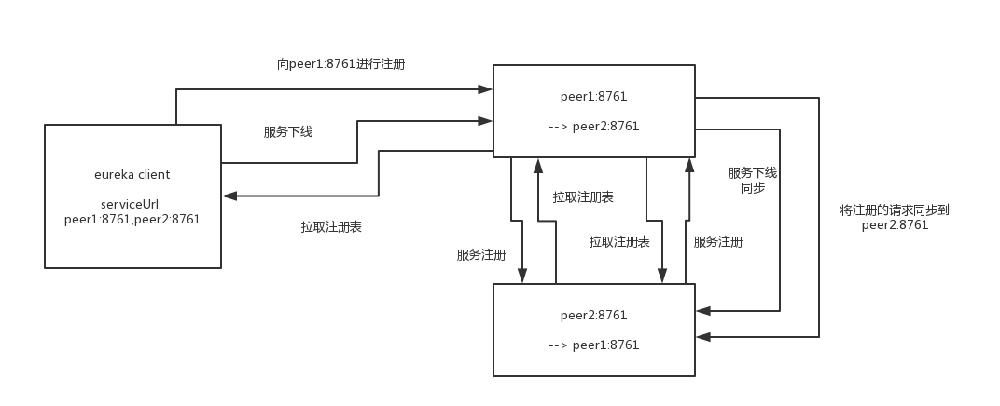
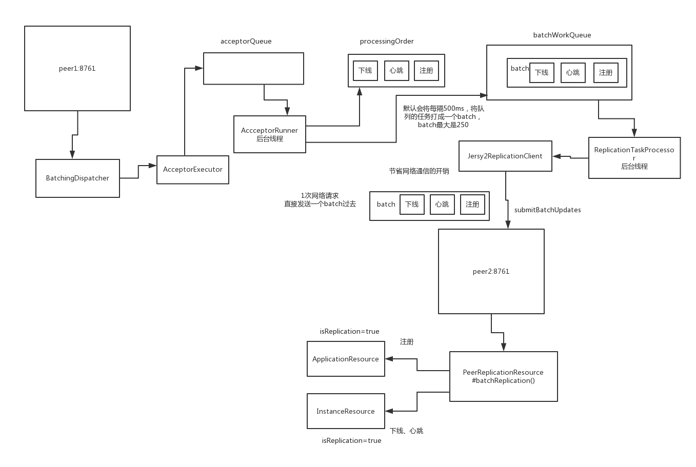

### 集群注册机制

- eureka core的BootStrap里面，有一块代码，是PeerEurekaNodes的代码，其实是在处理eureka server集群信息的初始化，会执行**PeerEurekaNodes.start()**方法
  - 解析配置文件中的其他eureka server的url地址，基于url地址构造一个一个的PeerEurekaNode，一个PeerEurekaNode就代表了一个eureka server。启动一个后台的线程，默认是每隔10分钟，会运行一个任务，就是基于配置文件中的url来刷新eureka server列表。
- **registry.syncUp()**
  - 就是说，当前这个eureka server会从任何一个其他的eureka server拉取注册表过来放在自己本地，作为初始的注册表。将自己作为一个eureka client，找任意一个eureka server来拉取注册表，将拉取到的注册表放到自己本地去
  - eurekaClient.getApplications()
  - eureka server自己本身本来就是个eureka client，在初始化的时候，就会去找任意的一个eureka server拉取注册表到自己本地来，把这个注册表放到自己身上来，作为自己这个eureka server的注册表
- 注册、下线、故障、心跳
  - 如何从一台eureka server同步到另外一台eureka server上去的
  - ApplicationResource的addInstance()方法，负责注册，现在自己本地完成一个注册，接着会replicateToPeers()方法，这个方法就会将这次注册请求，同步到其他所有的eureka server上去
  - 如果是某台eureka client来找eureka server进行注册，isReplication是false，此时会给其他所有的你配置的eureka server都同步这个注册请求，此时一定会基于jersey，调用其他所有的eureka server的restful接口，去执行这个服务实例的注册的请求
  - eureka-core-jersey2的工程，ReplicationHttpClient，此时同步注册请求给其他eureka server的时候，一定会将isReplication设置为true，这个东西可以确保说什么呢，其他eureka server接到这个同步的请求，仅仅在自己本地执行，不会再次向其他的eureka server去进行注册

### 同步任务批处理机制

- 集群同步的机制：闪光点，client可以找任何一个server发送请求，然后这个server会将请求同步到其他所有的server上去，但是其他的server仅仅会在自己本地执行，不会再次同步了

- 数据同步的异步批处理机制：闪光点，三个队列，第一个队列，就是纯写入；第二个队列，是用来根据时间和大小，来拆分队列；第三个队列，用来放批处理任务 ==> 异步批处理机制