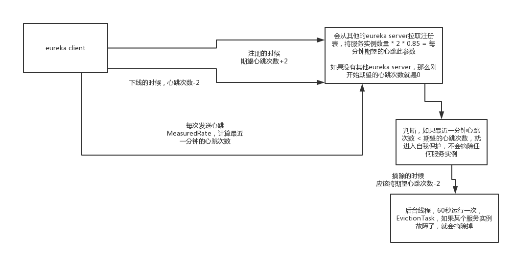

> 背景

假如说，20个服务实例，结果在1分钟之内，只有8个服务实例保持了心跳 --> eureka server是应该将剩余的12个没有心跳的服务实例都摘除吗？

这个时候很可能说的是，eureka server自己网络故障了，那些服务没问题的。只不过eureka server自己的机器所在的网络故障了，导致那些服务的心跳发送不过来。就导致eureka server本地一直没有更新心跳。

自己进入一个自我保护的机制，从此之后就不会再摘除任何服务实例了

注册表的evict()方法，EvictionTask，定时调度的任务，60s来一次，会判断一下服务实例是否故障了，如果故障了，一直没有心跳，就会将服务实例给摘除。

- evict()方法内部，先会**判断上一分钟的心跳次数，是否小于我期望的一分钟的心跳次数，如果小于，那么压根儿就不让清理任何服务实例**
- 期望的一分钟的心跳次数是怎么算出来的？
  - registry.openForTraffic(applicationInfoManager, registryCount);
  - 完成了numberOfRenewsPerMinThreshold这个值，我期望一分钟得有多少次心跳的值，初始化。刚开始会调用syncUp()的方法，从相邻的eureka server节点，拷贝过来注册表，如果是自己本地还没注册的服务实例，就在自己本地注册一下
  - 会记录一下从别的eureka server拉取过来的服务实例的数量，将这个服务实例的数量，就作为自己eureka server本地初始化的这么一个服务实例的数量。将服务实例数量 * 2
  - 假设现在我们默认的心跳是30秒1次，如果我调整了撑10秒一次心跳了？？？怎么办？？这里的count * 2，就错了
- Registry注册表，**默认是15分钟，会跑一次定时任务，算一下服务实例的数量，如果从别的eureka server拉取到的服务实例的数量，大于当前的服务实例的数量，会重新计算一下，主要是跟其他的eureka server做一下同步**
- 自我保护机制的触发
  - 如果上一分钟实际的心跳次数，比我们期望的一分钟的心跳次数要小，触发自我保护机制，不允许摘除任何服务实例，此时认为自己的eureka server出现网络故障，大量的服务实例无法发送心跳过来
  - 因为其实在线上的时候，最坑爹的就是这儿，就是你会发现有些服务实例下线了，但是eureka控制台老是没给他摘除，自我保护机制了
  - 线上生产环境，如果你可以的话，你可以选择将这个自我保护给关了。如果eureka server接收不到心跳的话，各个服务实例也是无法从eureka server拉取注册表的。

