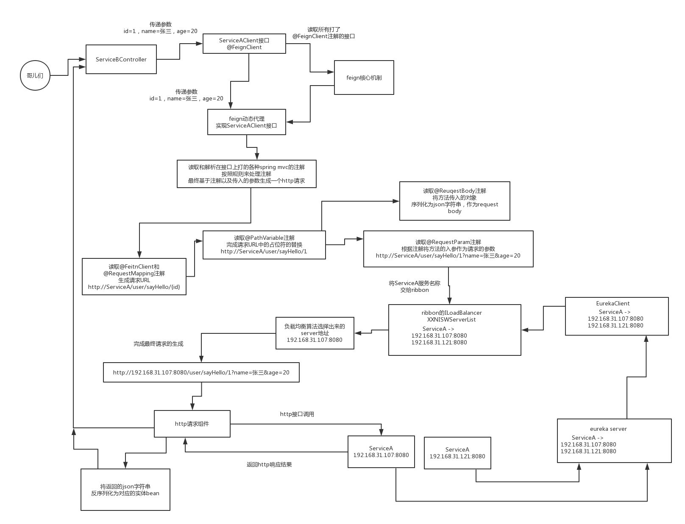
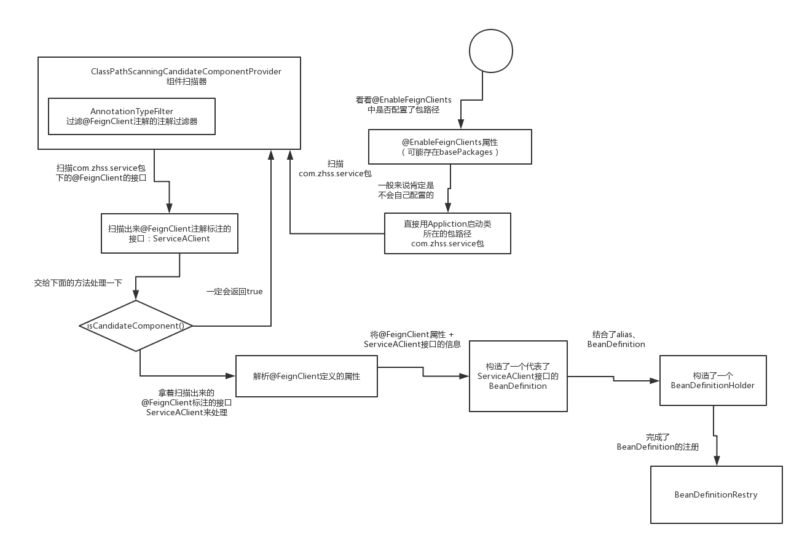
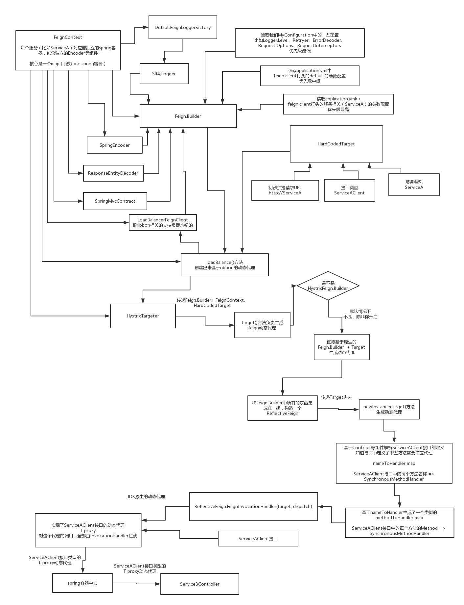
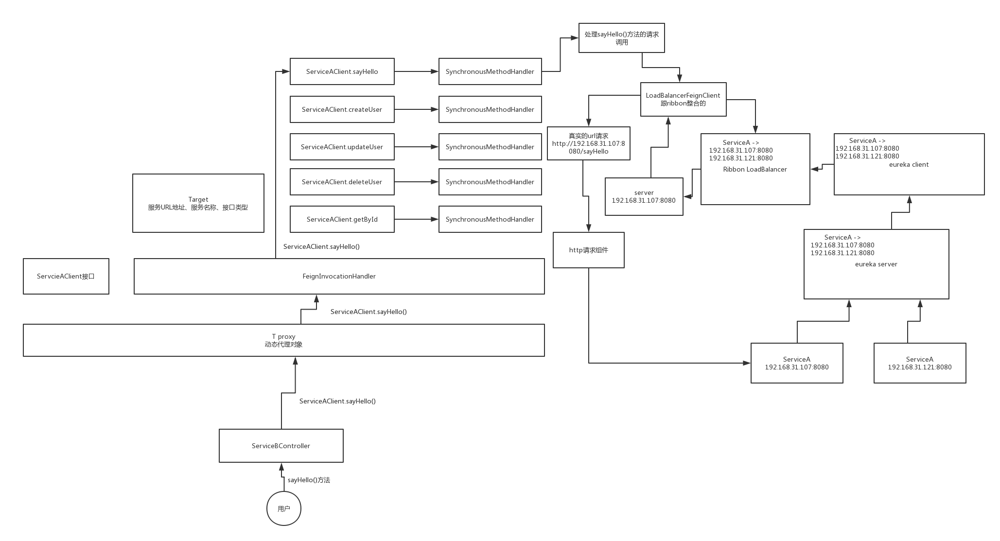
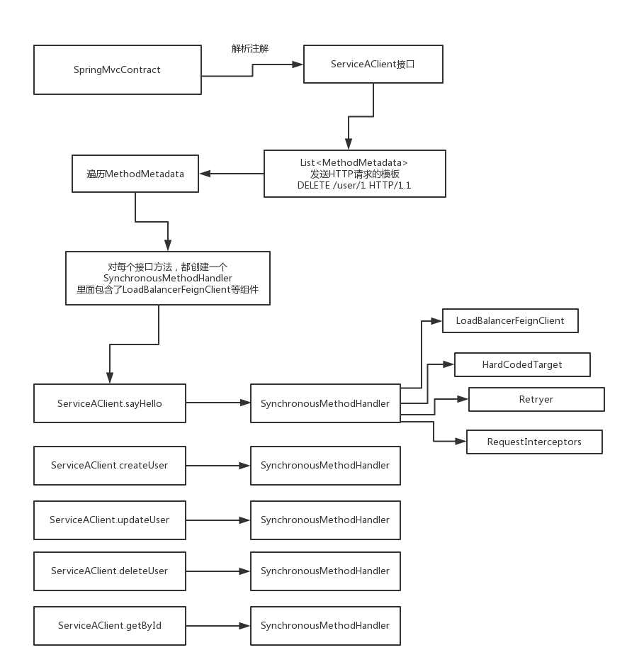

### 概述

> **@EnableFeignClients**、**@FeignClient**、**FeignClientRegistrar**
>
> FeignClientRegistrar 扫描所有包下的 @FeignClient 注解类，生成动态代理，然后结合 spring mvc 的注解生成 url，结合 ribbon 和 eureka 生成 host:ip ，使用默认的 http client 完成远程服务调用。



### 1. @EnableFeignClients

```java
@Retention(RetentionPolicy.RUNTIME)
@Target({ElementType.TYPE})
@Documented
@Import({FeignClientsRegistrar.class})
public @interface EnableFeignClients {
    String[] value() default {};

    String[] basePackages() default {};

    Class<?>[] basePackageClasses() default {};

    Class<?>[] defaultConfiguration() default {};

    Class<?>[] clients() default {};
}
```


### 2. FeignClientsRegistrar

```java
public void registerFeignClients(AnnotationMetadata metadata, BeanDefinitionRegistry registry) {
    // 扫描器
    ClassPathScanningCandidateComponentProvider scanner = this.getScanner();
    scanner.setResourceLoader(this.resourceLoader);
    Map<String, Object> attrs = metadata.getAnnotationAttributes(EnableFeignClients.class.getName());
    AnnotationTypeFilter annotationTypeFilter = new AnnotationTypeFilter(FeignClient.class);
    Class<?>[] clients = attrs == null ? null : (Class[])((Class[])attrs.get("clients"));
    Object basePackages;
    if (clients != null && clients.length != 0) {
        final Set<String> clientClasses = new HashSet();
        basePackages = new HashSet();
        Class[] var9 = clients;
        int var10 = clients.length;

        for(int var11 = 0; var11 < var10; ++var11) {
            Class<?> clazz = var9[var11];
            ((Set)basePackages).add(ClassUtils.getPackageName(clazz));
            clientClasses.add(clazz.getCanonicalName());
        }

        AbstractClassTestingTypeFilter filter = new AbstractClassTestingTypeFilter() {
            protected boolean match(ClassMetadata metadata) {
                String cleaned = metadata.getClassName().replaceAll("\\$", ".");
                return clientClasses.contains(cleaned);
            }
        };
        scanner.addIncludeFilter(new FeignClientsRegistrar.AllTypeFilter(Arrays.asList(filter, annotationTypeFilter)));
    } else {
        scanner.addIncludeFilter(annotationTypeFilter);
        basePackages = this.getBasePackages(metadata);
    }

    Iterator var17 = ((Set)basePackages).iterator();

    while(var17.hasNext()) {
        String basePackage = (String)var17.next();
        // 扫描 basePackage 下的 @FeignClient 注解并构建成 BeanDefinition
        Set<BeanDefinition> candidateComponents = scanner.findCandidateComponents(basePackage);
        Iterator var21 = candidateComponents.iterator();

        while(var21.hasNext()) {
            BeanDefinition candidateComponent = (BeanDefinition)var21.next();
            if (candidateComponent instanceof AnnotatedBeanDefinition) {
                AnnotatedBeanDefinition beanDefinition = (AnnotatedBeanDefinition)candidateComponent;
                AnnotationMetadata annotationMetadata = beanDefinition.getMetadata();
                Assert.isTrue(annotationMetadata.isInterface(), "@FeignClient can only be specified on an interface");
                Map<String, Object> attributes = annotationMetadata.getAnnotationAttributes(FeignClient.class.getCanonicalName());
                String name = this.getClientName(attributes);
                this.registerClientConfiguration(registry, name, attributes.get("configuration"));
                this.registerFeignClient(registry, annotationMetadata, attributes);
            }
        }
    }

}
```

```java
private void registerFeignClient(BeanDefinitionRegistry registry, AnnotationMetadata annotationMetadata, Map<String, Object> attributes) {
    String className = annotationMetadata.getClassName();
    BeanDefinitionBuilder definition = BeanDefinitionBuilder.genericBeanDefinition(FeignClientFactoryBean.class);
    this.validate(attributes);
    definition.addPropertyValue("url", this.getUrl(attributes));
    definition.addPropertyValue("path", this.getPath(attributes));
    String name = this.getName(attributes);
    definition.addPropertyValue("name", name);
    String contextId = this.getContextId(attributes);
    definition.addPropertyValue("contextId", contextId);
    definition.addPropertyValue("type", className);
    definition.addPropertyValue("decode404", attributes.get("decode404"));
    definition.addPropertyValue("fallback", attributes.get("fallback"));
    definition.addPropertyValue("fallbackFactory", attributes.get("fallbackFactory"));
    definition.setAutowireMode(2);
    String alias = contextId + "FeignClient";
    AbstractBeanDefinition beanDefinition = definition.getBeanDefinition();
    boolean primary = (Boolean)attributes.get("primary");
    beanDefinition.setPrimary(primary);
    String qualifier = this.getQualifier(attributes);
    if (StringUtils.hasText(qualifier)) {
        alias = qualifier;
    }

    BeanDefinitionHolder holder = new BeanDefinitionHolder(beanDefinition, className, new String[]{alias});
    BeanDefinitionReaderUtils.registerBeanDefinition(holder, registry);
}
```

> **BeanDefinitionBuilder definition = BeanDefinitionBuilder.genericBeanDefinition(FeignClientFactoryBean.class);**



### 3. FeignClientFactoryBean

> 用来创建核心的FeignClient组件的一个工厂bean

- 基于接口类名（ServiceAClient接口的类名），alias（ServiceAFeignClient），刚刚构造好的BeanDefinition，构造了一个 **BeanDefinitionHolder**

- 基于BeanDefinitionRegistry和BeanDefinitionHolder，完成了BeanDefinition的注册

- 下一步，其实就是应该去基于扫描出来的@FeignClient注解和ServiceAClident接口的信息，然后去创建实现ServiceAClient接口的动态代理，feign核心的动态代理，将动态代理作为一个bean，注入给ServiceBControler，然后ServiceBController后面调用的都是这个feign动态代理

- 扫描包下面的@FeignClient的注解，以及搞完了，扫描到内存里来了，形成了BeanDefinition

  下面一步，其实就是在spring容器初始化的时候，一定是会根据扫描出来的@FeignClient的信息，去构造一个原生的feign的FeignClient出来，然后基于这个FeignClient来构造一个ServiceAClient接口的动态代理

- FeignClientFactoryBean#getObject() 作为入口方法


### 4. FeignContext

> FeignContext（代表了一个独立的容器），关联着自己独立的一些组件，比如说独立的Logger组件，独立的Decoder组件，独立的Encoder组件，都是某个服务自己独立的
>
> 因为**对不同的服务调用的@FeignClient，都是可以自定义不同的Configuration的**


### 5. Feign.Builder

> ```
> Builder builder = this.feign(context);
> ```

> 用于构建 Feign 客户端

- 如果你在@FeignClient上，没有配置url属性，也就是你没有自己指定服务的url地址，那么就会自动跟ribbon关联起来，采用ribbon来进行负载均衡，直接就开始为ribbon来准备对应的url地址了：http://ServiceA

- HardCodedTarget，硬编码的Target，里面包含了接口类型（com.zhss.service.ServiceAClient）、服务名称（ServiceA）、url地址（http://ServiceA），跟Feign.Builder、FeignContext，一起，传入了loadBalance()方法里去

- FeignRibbonClientAutoConfiguration

- DefaultFeignLoadBalancedConfiguration

  HttpClientFeignLoadBalancedConfiguration

  OkHttpFeignLoadBalancedConfiguration

- 默认的就是这里返回的 **LoadBalancerFeignClient**




### 6. 创建动态代理 ReflectiveFeign#newInstance(Target)

> 基于Feign.Builder和HardCodedTarget，来最终基于feign的动态代理的机制，针对一个接口创建出来动态代理

- **`ReflectiveFeign#newInstance(Target)`**
- **`HardCodedTarget`**
- **`SynchronousMethodHandler`**
- **每个方法都创建了一个对应的SynchronousMethodHandler，同步方法处理器，这个SynchronousMethodHandler里面包含了后面发送请求需要的所有的组件，LoadBalancerFeignClient、Retryer（负责请求重试）、请求拦截器、日志打印的东西，等等**

```java
public <T> T newInstance(Target<T> target) {
    // HardCodedTarget SynchronousMethodHandler
    // 这行代码，其实很关键，他其实是对我们定义的ServiceAClient接口进行解析，解析里面有哪些方法，然后为每个方法创建一个SynchronousMethodHandler出来，也就是说那个MethodHandler专门用来处理那个方法的请求调用
    Map<String, MethodHandler> nameToHandler = this.targetToHandlersByName.apply(target);
    Map<Method, MethodHandler> methodToHandler = new LinkedHashMap();
    List<DefaultMethodHandler> defaultMethodHandlers = new LinkedList();
    Method[] var5 = target.type().getMethods();
    int var6 = var5.length;

    for(int var7 = 0; var7 < var6; ++var7) {
        Method method = var5[var7];
        if (method.getDeclaringClass() != Object.class) {
            if (Util.isDefault(method)) {
                DefaultMethodHandler handler = new DefaultMethodHandler(method);
                defaultMethodHandlers.add(handler);
                methodToHandler.put(method, handler);
            } else {
                methodToHandler.put(method, nameToHandler.get(Feign.configKey(target.type(), method)));
            }
        }
    }
	// JDK 动态代理类的创建
    InvocationHandler handler = this.factory.create(target, methodToHandler);
    T proxy = Proxy.newProxyInstance(target.type().getClassLoader(), new Class[]{target.type()}, handler);
    Iterator var12 = defaultMethodHandlers.iterator();

    while(var12.hasNext()) {
        DefaultMethodHandler defaultMethodHandler = (DefaultMethodHandler)var12.next();
        defaultMethodHandler.bindTo(proxy);
    }

    return proxy;
}
```




### 7. SpringMvcContract

