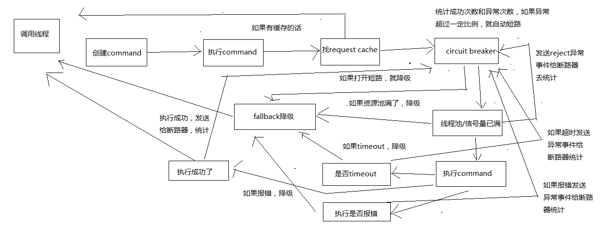

1. 构建一个HystrixCommand或者HystrixObservableCommand

> 一个HystrixCommand或一个HystrixObservableCommand对象，代表了对某个依赖服务发起的一次请求或者调用,构造的时候，可以在构造函数中传入任何需要的参数


2. 调用 command 的执行方法

> 要执行Command，需要在4个方法中选择其中的一个：execute()，queue()，observe()，toObservable()
>
> 其中execute()和queue()仅仅对HystrixCommand适用

- execute()：调用后直接block住，属于同步调用，直到依赖服务返回单条结果，或者抛出异常
- queue()：返回一个Future，属于异步调用，后面可以通过Future获取单条结果
- observe()：订阅一个Observable对象，Observable代表的是依赖服务返回的结果，获取到一个那个代表结果的Observable对象的拷贝对象
- toObservable()：返回一个Observable对象，如果我们订阅这个对象，就会执行command并且获取返回结果

```java
K             value   = command.execute();
Future<K>     fValue  = command.queue();
Observable<K> ohValue = command.observe();         
Observable<K> ocValue = command.toObservable(); 
```

- execute()实际上会调用queue().get().queue()，接着会调用toObservable().toBlocking().toFuture()

  也就是说，无论是哪种执行command的方式，最终都是依赖toObservable()去执行的

  

3. 检查是否开启缓存

> 如果这个command开启了请求缓存，request cache，而且这个调用的结果在缓存中存在，那么直接从缓存中返回结果


4. 检查是否开启了短路器

> 如果断路器被打开了，那么hystrix就不会执行这个command，而是直接去执行fallback降级机制


5. 检查线程池/队列/semaphore是否已经满了

> 如果command对应的线程池/队列/semaphore已经满了，那么也不会执行command，而是直接去调用fallback降级机制


6. 执行command

> 调用HystrixObservableCommand.construct()或HystrixCommand.run()来实际执行这个command
>
> 如果timeout了，也会去执行fallback降级机制，而且就不会管run()或construct()返回的值了


7. 短路健康检查

> Hystrix会将每一个依赖服务的调用成功，失败，拒绝，超时，等事件，都会发送给circuit breaker断路器
>
> 短路器就会对调用成功/失败/拒绝/超时等事件的次数进行统计
>
> 短路器会根据这些统计次数来决定，是否要进行短路，如果打开了短路器，那么在一段时间内就会直接短路，然后如果在之后第一次检查发现调用成功了，就关闭断路器


8. 调用 **fallback** 降级机制

> 在以下几种情况中，hystrix会调用fallback降级机制：run()或construct()抛出一个异常，短路器打开，线程池/队列/semaphore满了，command执行超时了
>
>  
>
> 一般在降级机制中，都建议给出一些默认的返回值，比如静态的一些代码逻辑，或者从内存中的缓存中提取一些数据，尽量在这里不要再进行网络请求了
>
>  
>
> 即使在降级中，一定要进行网络调用，也应该将那个调用放在一个HystrixCommand中，进行隔离
>
>  
>
> 在 **HystrixCommand#getFallback()** 方法，可以提供降级机制
>
>  
>
> **HystirxObservableCommand#resumeWithFallback()** 方法，返回一个Observable对象，可以提供降级结果
>
>  
>
> 如果fallback返回了结果，那么hystrix就会返回这个结果
>
> 如果没有实现fallback，或者是fallback抛出了异常，Hystrix会返回一个Observable，但是不会返回任何数据

不同的command执行方式，其fallback为空或者异常时的返回结果不同

 

对于execute()，直接抛出异常

对于queue()，返回一个Future，调用get()时抛出异常

对于observe()，返回一个Observable对象，但是调用subscribe()方法订阅它时，理解抛出调用者的onError方法

对于toObservable()，返回一个Observable对象，但是调用subscribe()方法订阅它时，理解抛出调用者的onError方法

