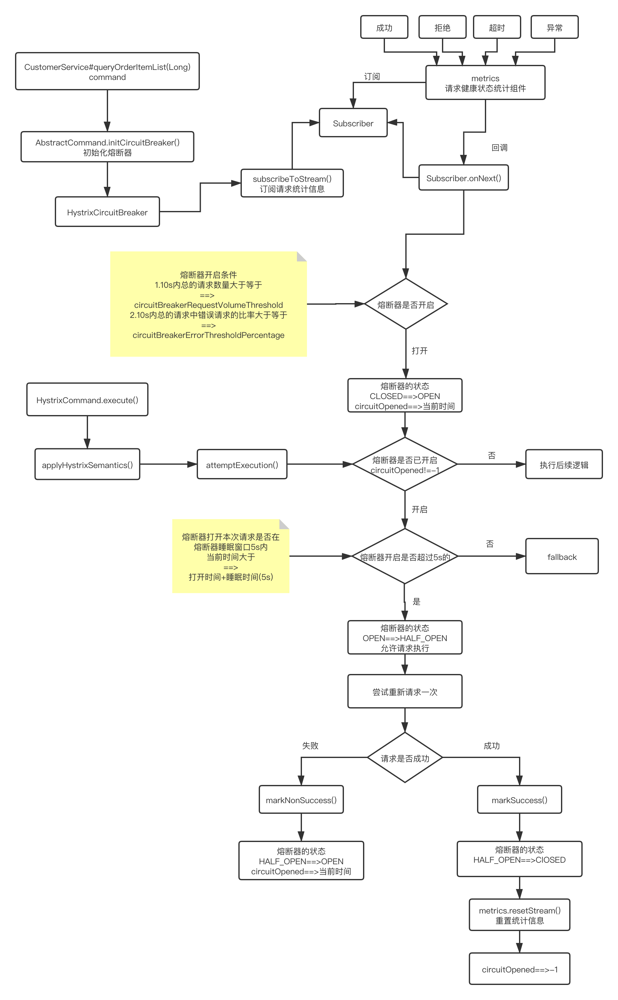

### 1. 流程



1. 如果经过短路器的流量超过了一定的阈值，**HystrixCommandProperties.circuitBreakerRequestVolumeThreshold()**

> 举个例子，可能看起来是这样子的，要求在10s内，经过短路器的流量必须达到20个；在10s内，经过短路器的流量才10个，那么根本不会去判断要不要短路

 

2. 如果断路器统计到的异常调用的占比超过了一定的阈值，**HystrixCommandProperties.circuitBreakerErrorThresholdPercentage()**

> 如果达到了上面的要求，比如说在10s内，经过短路器的流量（你，只要执行一个command，这个请求就一定会经过短路器），达到了30个；同时其中异常的访问数量，占到了一定的比例，比如说60%的请求都是异常（报错，timeout，reject），会开启短路

 

3. 然后断路器从 close 状态转换到 open 状态

 

4. 断路器打开的时候，所有经过该断路器的请求全部被短路，不调用后端服务，直接走fallback 降级

 

5. 经过了一段时间之后，**HystrixCommandProperties.circuitBreakerSleepWindowInMilliseconds()**，

> 会 **half-open**，让一条请求经过短路器，看能不能正常调用。如果调用成功了，那么就自动恢复，转到close状态
>
> 短路器，会自动恢复的，half-open，半开状态


### 2. 相关配置

- **circuitBreaker.enabled**

> 控制短路器是否允许工作，包括跟踪依赖服务调用的健康状况，以及对异常情况过多时是否允许触发短路，默认是true

```java
HystrixCommandProperties.Setter()
  .withCircuitBreakerEnabled(boolean value)
```


- **circuitBreaker.requestVolumeThreshold**

> 设置一个rolling window，滑动窗口中，最少要有多少个请求时，才触发开启短路
>
>  
>
> 举例来说，如果设置为20（默认值），那么在一个10秒的滑动窗口内，如果只有19个请求，即使这19个请求都是异常的，也是不会触发开启短路器的

```java
HystrixCommandProperties.Setter()
  .withCircuitBreakerRequestVolumeThreshold(int value)
```

 

- **circuitBreaker.sleepWindowInMilliseconds**

> 设置在短路之后，需要在多长时间内直接reject请求，然后在这段时间之后，再重新导half-open状态，尝试允许请求通过以及自动恢复，**默认值是5000毫秒**

```java
HystrixCommandProperties.Setter()
  .withCircuitBreakerSleepWindowInMilliseconds(int value)
```


- **circuitBreaker.errorThresholdPercentage**

> 设置异常请求量的百分比，当异常请求达到这个百分比时，就触发打开短路器，**默认是50，也就是50%**

```java
HystrixCommandProperties.Setter()
  .withCircuitBreakerErrorThresholdPercentage(int value)
```

 

- **circuitBreaker.forceOpen**

> 如果设置为true的话，直接强迫打开短路器，相当于是手动短路了，手动降级，**默认false**

```java
HystrixCommandProperties.Setter()
  .withCircuitBreakerForceOpen(boolean value)
```


- circuitBreaker.forceClosed

>  如果设置为ture的话，直接强迫关闭短路器，相当于是手动停止短路了，手动升级，**默认false**

```java
HystrixCommandProperties.Setter()
  .withCircuitBreakerForceClosed(boolean value)
```

