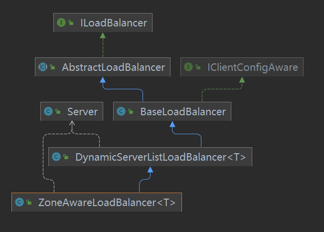
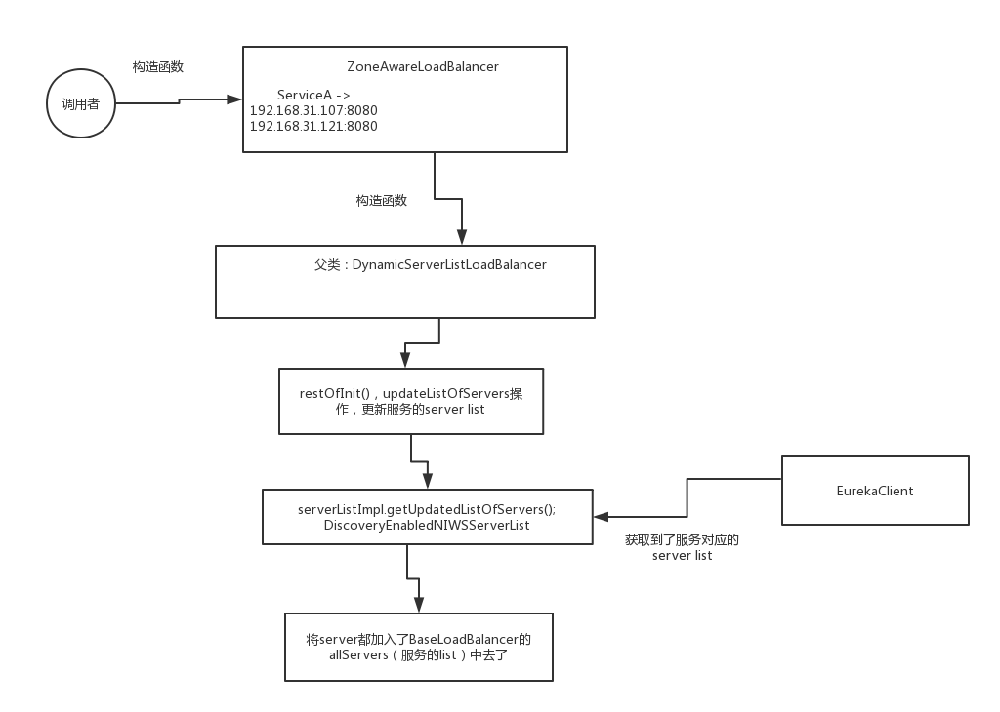
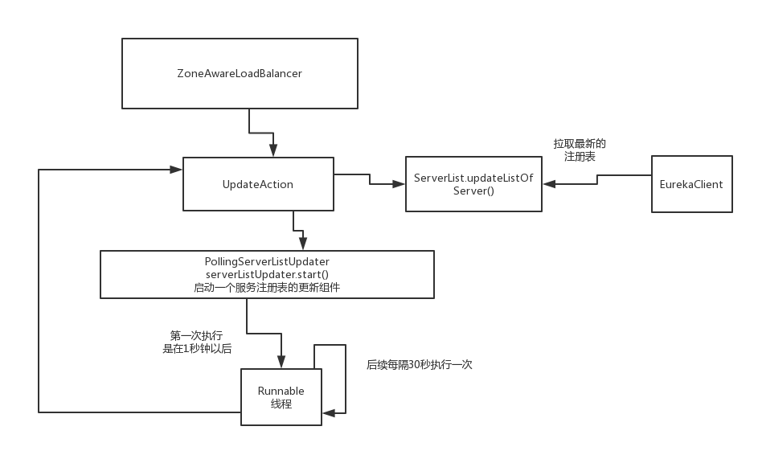

### 1. ZoneAwareLoadBalancer

> 默认 LoadBalancer




### 2. RibbonClientConfiguration

> spring-cloud-netflix-ribbon

```java
@Bean
@ConditionalOnMissingBean
public ILoadBalancer ribbonLoadBalancer(IClientConfig config,
		ServerList<Server> serverList, ServerListFilter<Server> serverListFilter,
		IRule rule, IPing ping, ServerListUpdater serverListUpdater) {
	if (this.propertiesFactory.isSet(ILoadBalancer.class, name)) {
		return this.propertiesFactory.get(ILoadBalancer.class, config, name);
	}
	return new ZoneAwareLoadBalancer<>(config, rule, ping, serverList,
			serverListFilter, serverListUpdater);
}
```


### 3. 初始获取 Eureka 服务列表

> DynamicServerListLoadBalancer#updateListOfServers()




#### 4. 持续获取 Eureka 服务列表

> PollingServerListUpdater#start(UpdataAction)



```java
@Override
public synchronized void start(final UpdateAction updateAction) {
    if (isActive.compareAndSet(false, true)) {
        final Runnable wrapperRunnable = new Runnable() {
            @Override
            public void run() {
                if (!isActive.get()) {
                    if (scheduledFuture != null) {
                        scheduledFuture.cancel(true);
                    }
                    return;
                }
                try {
                    updateAction.doUpdate();
                    lastUpdated = System.currentTimeMillis();
                } catch (Exception e) {
                    logger.warn("Failed one update cycle", e);
                }
            }
        };

        scheduledFuture = getRefreshExecutor().scheduleWithFixedDelay(
                wrapperRunnable,
                initialDelayMs,
                refreshIntervalMs,
                TimeUnit.MILLISECONDS
        );
    } else {
        logger.info("Already active, no-op");
    }
}
```

> 在PollingServerListUpdater中，创建了一个Runnable线程，里面就是执行UpdateAction的行为。。。在延迟一定的时间过后，每隔一定的时间就执行一下那个Runnable线程，就会执行UpdateAction中的操作来刷新注册表，从eureka client中获取注册表，然后刷新到LoadBalancer中去。。。
>
> 默认的是1秒钟过后，会第一次执行那个Runnable线程，以后是每隔30秒执行一下那个Runnable线程，就去从eureka client刷新注册表到自己的ribbon的LoadBalancer中来。