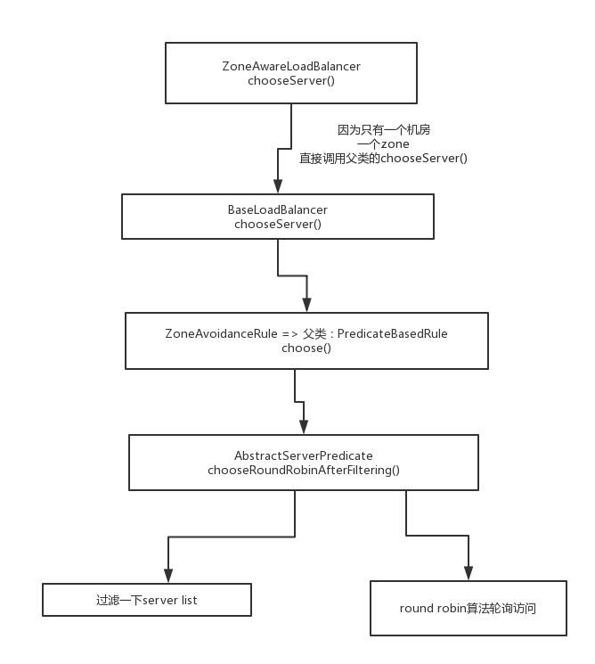
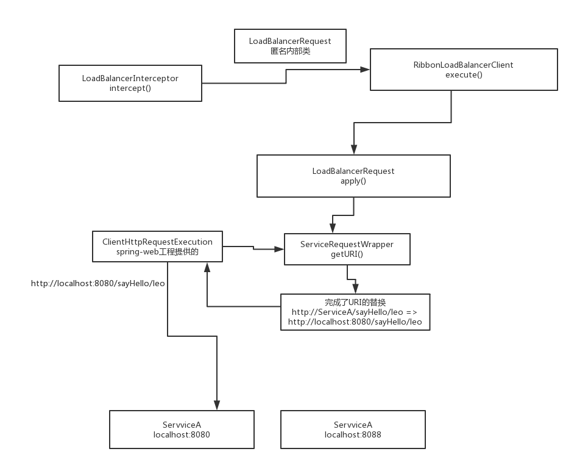

### 默认负载均衡算法



> **1.ZoneAwareLoadBalancer#chooseServer(Object key)**

```java
@Override
public Server chooseServer(Object key) {
    if (!ENABLED.get() || getLoadBalancerStats().getAvailableZones().size() <= 1) {
        logger.debug("Zone aware logic disabled or there is only one zone");
        return super.chooseServer(key);
    }
    Server server = null;
    try {
        LoadBalancerStats lbStats = getLoadBalancerStats();
        Map<String, ZoneSnapshot> zoneSnapshot = ZoneAvoidanceRule.createSnapshot(lbStats);
        logger.debug("Zone snapshots: {}", zoneSnapshot);
        if (triggeringLoad == null) {
            triggeringLoad = DynamicPropertyFactory.getInstance().getDoubleProperty(
                    "ZoneAwareNIWSDiscoveryLoadBalancer." + this.getName() + ".triggeringLoadPerServerThreshold", 0.2d);
        }

        if (triggeringBlackoutPercentage == null) {
            triggeringBlackoutPercentage = DynamicPropertyFactory.getInstance().getDoubleProperty(
                    "ZoneAwareNIWSDiscoveryLoadBalancer." + this.getName() + ".avoidZoneWithBlackoutPercetage", 0.99999d);
        }
        Set<String> availableZones = ZoneAvoidanceRule.getAvailableZones(zoneSnapshot, triggeringLoad.get(), triggeringBlackoutPercentage.get());
        logger.debug("Available zones: {}", availableZones);
        if (availableZones != null &&  availableZones.size() < zoneSnapshot.keySet().size()) {
            String zone = ZoneAvoidanceRule.randomChooseZone(zoneSnapshot, availableZones);
            logger.debug("Zone chosen: {}", zone);
            if (zone != null) {
                BaseLoadBalancer zoneLoadBalancer = getLoadBalancer(zone);
                server = zoneLoadBalancer.chooseServer(key);
            }
        }
    } catch (Exception e) {
        logger.error("Error choosing server using zone aware logic for load balancer={}", name, e);
    }
    if (server != null) {
        return server;
    } else {
        logger.debug("Zone avoidance logic is not invoked.");
        return super.chooseServer(key);
    }
}
```

> **2. ZoneAvoidanceRule --> 父类 PredicateBasedRule#choose()**
>
> PredicateBasedRule.choose()方法，先执行过滤规则，过滤掉一批server，根据你自己指定的filter规则，然后用round robin轮询算法，依次获取下一个server

```java
public abstract class PredicateBasedRule extends ClientConfigEnabledRoundRobinRule {
   
    /**
     * Method that provides an instance of {@link AbstractServerPredicate} to be used by this class.
     * 
     */
    public abstract AbstractServerPredicate getPredicate();
        
    /**
     * Get a server by calling {@link AbstractServerPredicate#chooseRandomlyAfterFiltering(java.util.List, Object)}.
     * The performance for this method is O(n) where n is number of servers to be filtered.
     */
    @Override
    public Server choose(Object key) {
        ILoadBalancer lb = getLoadBalancer();
        Optional<Server> server = getPredicate().chooseRoundRobinAfterFiltering(lb.getAllServers(), key);
        if (server.isPresent()) {
            return server.get();
        } else {
            return null;
        }       
    }
}
```

> **3. 轮询算法实现：AbstractServerPredicate#incrementAndGetModulo(int modulo)**
>
> ```java
> private int incrementAndGetModulo(int modulo) {
>     for (;;) {
>         int current = nextIndex.get();
>         int next = (current + 1) % modulo;
>         if (nextIndex.compareAndSet(current, next) && current < modulo)
>             return current;
>     }
> }
> ```


### 发起 Http 请求

