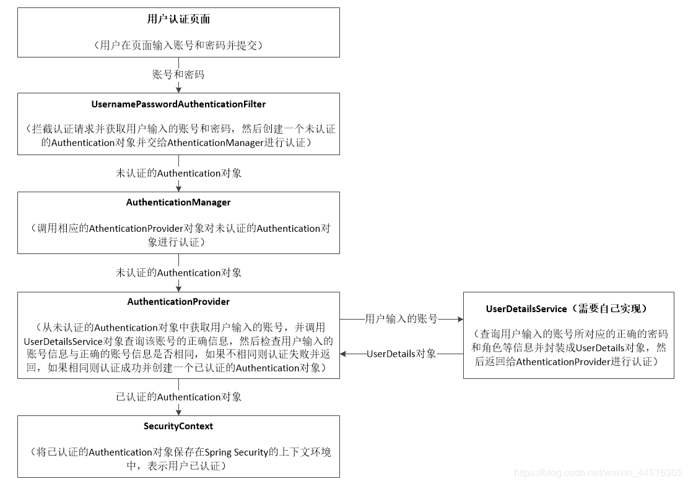

### Spring Security

> 几个概念

```
1. 认证(Authentication)
    用于实体(Principal)身份的安全校验
2. 授权(Authorization)
    用于实体对某些资源的权限控制
3. 凭证(Credential)
    系统如何保证它与用户之间的承诺是双方当时真实意图的体现，是准确、完整且不可抵赖的
```
---
- 认证用户模型
```
1. 继承自平台真正用户实体的同时实现 UserDetails 接口
2. 包含权限列表 Collection<GrantedAuthority> authorities
3. 权限列表数据来源于数据库
```
- 用户认证信息查询服务
```
1. 实现 UserDetailsService 接口
2. 重写 UserDetails loadUserByUsername(String username) 方法，返回上述认证用户模型
```
- 身份认证器
```
1. 实现 AuthenticationProvider 接口
2. 重写 Authentication authenticate(Authentication authentication) 方法
3. 上述用户认证信息查询服务作为注入属性类辅助完成上一操作，然后返回 Authentication 实现子类，如UsernamePasswordAuthenticationToken 
```
- 用户认证服务器配置
```
1. 继承 WebSecurityConfiguration(见下文)
2. 配置 @EnableWebSecurity 注解
3. 注入用户认证信息查询服务、身份认证器、密码编码器
4. @Bean 暴露认证管理器 AuthenticationManager 以便在授权服务器中使用
5. 重写 configure(AuthenticationManagerBuilder auth) 配置认证服务
```
- 授权服务器配置
```
1. 继承 AuthorizationServerConfigurerAdapter，作用：
        配置授权服务 Endpoint 及 Endpoint 本身的安全约束，配置客户端详情服务
2. 配置 @EnableAuthorizationServer 注解
3. 注入令牌服务(DefaultTokenServices)、Oauth2客户端信息服务(ClientDetailsService)、认证服务管理器(AuthenticationManager)、用户信息服务(UserDetailsService)
```
- JWT 访问令牌
```  
- JWT 令牌结构： [令牌头（Header）].[负载信息（Payload）].[签名（Signature）]
    - Header：令牌元数据，如采用的签名算法，默认为 HMAC SHA256 算法
    - Payload：由签发者自定义的数据，一般包括过期时间(Expire)、授权范围(Authority)、令牌ID编号(JTI)等
    - Signature：签名是使用私钥的Header指定的算法，前两部分进行的数字签名，防止数据篡改
    - 以上，Header和Payload都是JSON结构，进行BaseURLEncode之后进行签名，然后用"."连接，构成令牌报文
- JwtAccessTokenConverter
    - 来自 Spring Security OAuth2，提供了令牌的基础结构（令牌头、部分负载，如过期时间、JTI）的转换实现
    - 继承此类，在加入自己定义的负载信息即可使用。一般来说负载中至少要告知服务端当前用户是谁
```
- JWT 访问令牌服务
```
1. 继承 DefaultTokenServices，定义了令牌如何存储、携带哪些信息、如何签名、持续多长时间等
2. 会被授权服务配置类配置Endpoint时使用到
```
- 资源服务器配置
```
- 用于配置资源服务的访问权限，有两种方式：
    - HttpSecurity#antMatchers 方法集中配置
    - 启用全局方法级别安全支持(@EnableGlobalMethodSecurity),在各个资源的访问方法前，通过注解逐个配置，包括的注解有：
        - JSR 250的标准注解：@RolesAllowed --> 可完整替代Spring 的 @Secured
        - 支持 Spring EL 表达式的 Spring 注解：@PreAuthorize、@PostAuthorize
具体实现：
1. 继承 ResourceServerConfigurerAdapter
2. 添加 @EnableResourceServer 注解
```
- Spring Security 安全配置类
```
- 移除静态资源目录的安全控制，避免Spring Security默认禁止HTTP缓存的行为
- 继承 WebSecurityConfigurerAdapter
```

