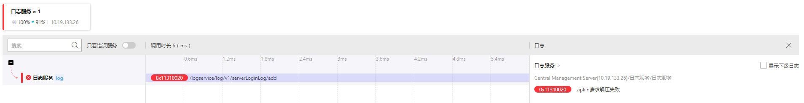

#### 1. 问题描述

描述：logservice 正常请求携带了别的方法的错误信息

#### 2. 问题分析

    原因：span上报到日志服务的zipkin接收端口发生解析错误（原因未知），使用hik.log.sdk打印了错误码，默认会将错误码信息设置到MDC中（MDC.put("errorCode", errorCode)），MDC的上下文对应着当前线程（Tomcat请求线程，由线程池管理）。当下一次请求过来时，tomcat会从线程中调度线程来处理，如果是上一个含有MDC错误码信息的线程来处理的话，在请求结束时（不管期间是否有错误发生），会在调用链库拦截器的postHandle方法中自动关联当前线程MDC中的错误码信息，从而导致上图的效果。

#### 3. 解决方法

	在调用链库拦截器的preHandle和postHandle方法中清除MDC中的错误码信息

