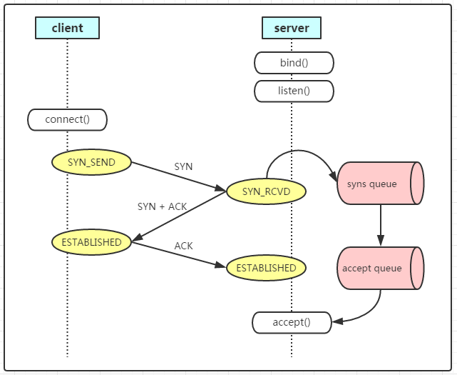
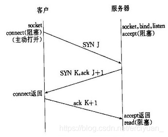
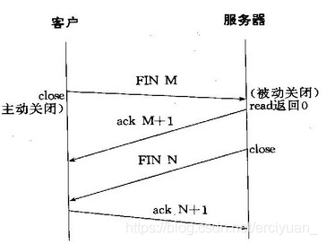

### TCP连接概述

```
连接：客户端和服务端之间基于 TCP 协议的虚拟双向信道
连接是有成本的：
	1. 三次握手和四次挥手（数据包的传递）
	2. CPU资源
	3. 缓存资源：OS创建的 SOCKET 是有限的，socket 自身还有缓存
	# /proc/sys/net/ipv4/tcp_rmem
	# /proc/sys/net/ipv4/tcp_wmem
	# /proc/sys/net/ipv4/tcp_mem
```







### keepalive 机制

> TCP连接一旦建立后，是否可以一直保存这个连接？

答案是否定的，OS(Linux) 对 TCP 协议的实现做了以下限制：

```
cat /proc/sys/net/ipv4/tcp_keepalive_time
# 默认保活时间 7200S，2小时，以TCP连接发送完最后一个ACK包计算
cat /proc/sys/net/ipv4/tcp_keepalive_intvl
# 默认75S，表示探测包发送的间隔时间，保活时间到了以后就间隔75S发探测包检测是否有断开连接的必要
cat /proc/sys/net/ipv4/tcp_keepalive_probes
# 默认为9，表示连续发送探测包的次数
```

tcp keepalive 默认是不开启的，如果想使用，**需要在应用中设置 SO_KEEPALIVE 才生效**


### 长连接

```
指在一个 TCP 连接上可以连续发送多个数据包，在 TCP 保持期间，如果没有数据包发送，需要双方发心跳检测包以维持此连接，一般需要自己做在线维持（不发生 RST 包和四次挥手）
```


### 短连接

```
通信双方有数据交互时，就创建一个 TCP 连接，数据发送完就断开连接。
```

### 总结

如果业务来往频繁，使用长连接

如果 Server 要主动給 Client 发数据，选择长连接